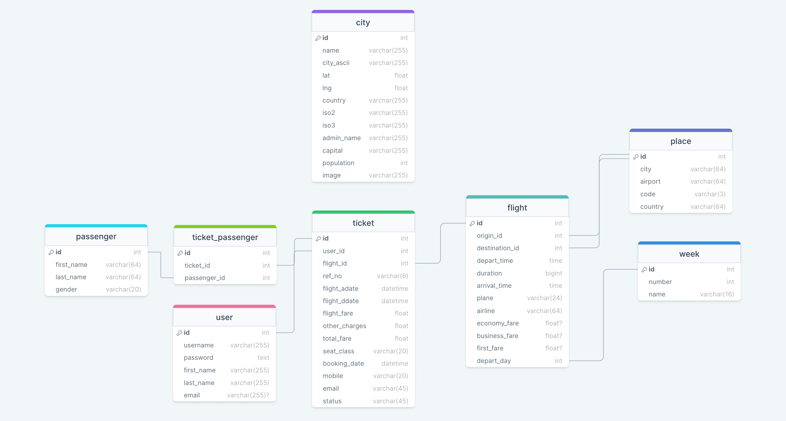

## Travel Assistant APP
This is an application that allow users to browse flight ticket options and book them in one stop

**Deployment Address**: https://zgu-cpsc519.herokuapp.com/

### Major Features
- user account registration
- log-in with Google account
- search for round-trip and one-way tickets
- ticket filters (e.g. filter by price, departure time, arrival time)
- city/airport auto suggestion as user types in the search box
- travel destination recommendation 
- mock payment process
- "My Bookings" page with ticket status display
- ticket cancelation
- add booked tickets as an event to google calendar

### Tech Stack
**Backend**: Flask with Jinja template rendering engine, SQLAlchemy as ORM for our sqlite database 
**Frontend**: HTML, CSS, Javascript  
**Deployment**: Heroku

### Database Schema

### Some Implementation Decisions
1. The flight data used in our application is not up-to-date and some are mocked data. We initially used a third party API to fetch up-to-date flight ticket information, but the response time was very slow. Therefore, we decided to store some of the flight ticket information in the database and only use these data to demo the feature. A downside of this implementation decision is that a user may not be able to find tickets to his/her destination if we don't have such flight information in our database.  
Here are some examples that work:  
    - JFK to LAX, All week
    - LAX to JFK, All week
    - LAX to ATL, any Tuesday
    - SFO to BOS, any Saturday
    - JFK to SFO, any Thursday
    - JFK to ORD, any Saturday
    - ORD to SFO, All week
    - SFO to JFK, All week
    - SFO to ORD, any Thursday
    - SFO to LAX, any Tuesday

2. According to our current database schema design, we are not deleting the flight tickets if the user chooses to cancel a ticket. We assumed that it would not incur a great impact on database query speed since SQL databases have great query optimizations. In a production environment, it would be best to remove some old data once in a while.
3. The trip destination recommendation can be more informative, like including a page with detailed description of the city being recommended. Due to time constraint, we were only able to show a short description of the recommended city with an image of that city being displayed.

### How To Run It Locally
- switch to `dev` branch (main is the deployment branch, the setup is a little different) 
- Install Python 3.10
- Install all required dependencies by running `pip install requirement.txt`
- run `python app.py`

